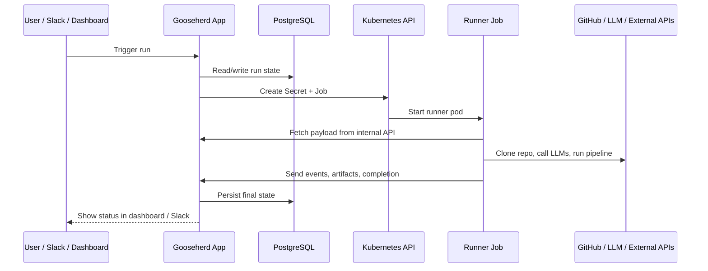
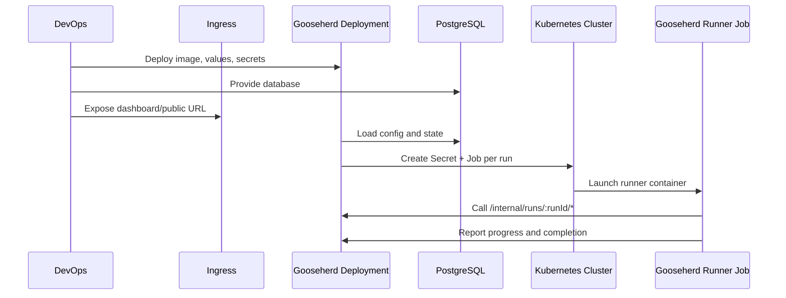

# Kubernetes Installation Guide

This document is a deployment handoff for DevOps/SRE teams that need to run Gooseherd on their own Kubernetes infrastructure.

It describes the project's current Kubernetes deployment contract:

- the Gooseherd control plane runs as a normal long-lived application inside the cluster
- PostgreSQL is provided in-cluster or as an external managed service
- per-run execution happens in Kubernetes `Job` resources created by Gooseherd itself when `SANDBOX_RUNTIME=kubernetes`

This guide does not ship a Helm chart or raw manifests. It explains what your chart or platform deployment must provide.

## Purpose And Scope

Use this guide when you want a full in-cluster deployment:

- Gooseherd application in Kubernetes
- PostgreSQL reachable from Kubernetes
- Dashboard/API exposed through a cluster `Service` and optionally an `Ingress`
- Gooseherd worker runs executed as Kubernetes `Job` resources

This same deployment model is also the right direction for local `minikube` work.
For local development, treat `minikube` as a lightweight Kubernetes cluster and run Gooseherd inside it.
Do not treat `docker compose up gooseherd` as the primary local path for Kubernetes runtime mode.

This guide is based on the current repository state, especially:

- `docker-compose.yml`
- `.env.example`
- `kubernetes/app.Dockerfile`
- `kubernetes/local/*`
- `src/config.ts`
- `src/index.ts`
- `src/runtime/kubernetes-backend.ts`
- `src/runtime/kubernetes/job-spec.ts`
- `kubernetes/runner.Dockerfile`

## High-Level Flow



## What Gets Deployed

From a Kubernetes perspective, Gooseherd consists of these pieces:

1. `Gooseherd control plane`
   Runs the main Node.js application, dashboard, internal runner API, schedulers, Slack integration, and runtime orchestration logic.

2. `PostgreSQL`
   Stores runs, setup state, control-plane metadata, and encrypted secrets.

3. `Persistent app storage`
   Used for `.work` and `data` directories if you want state/artifacts to survive pod restarts.

4. `Runner image`
   A separate container image used for per-run Kubernetes jobs. Built from `kubernetes/runner.Dockerfile`.

5. `Cluster networking`
   Required for:
   - user traffic to the dashboard
   - Gooseherd to reach GitHub, LLM providers, Slack, Sentry, and other external APIs
   - runner jobs to reach Gooseherd's internal API endpoint

## Control Plane And Runner Sequence



## Required Kubernetes Resources

Your deployment should provide at least:

- `Namespace`
  Recommended dedicated namespace for Gooseherd and its runner jobs.

- `Deployment`
  Runs the main Gooseherd control-plane container.

- `Service`
  Exposes the Gooseherd app on port `8787`.

- `Ingress`
  Optional but recommended for dashboard access from outside the cluster.

- `ConfigMap`
  Stores non-secret environment values.

- `Secret`
  Stores sensitive environment variables.

- `PersistentVolumeClaim`
  Recommended for:
  - `/app/.work`
  - `/app/data`

- `PostgreSQL`
  Either:
  - an in-cluster PostgreSQL release/service
  - or an external managed PostgreSQL instance reachable from the cluster

- `ServiceAccount` and `Role`/`RoleBinding`
  Required so the Gooseherd app can create and delete:
  - `jobs`
  - `pods`
  - `secrets`

## Local Minikube Interpretation

If you are validating Kubernetes mode locally with `minikube`, aim for the same shape as production:

- PostgreSQL deployed into `minikube` or otherwise reachable from Gooseherd inside `minikube`
- Gooseherd deployed into `minikube`
- Gooseherd pod authenticating to the Kubernetes API through its pod identity
- runner jobs calling Gooseherd through cluster DNS
- local browser access handled separately through `kubectl port-forward` or `minikube service`

This avoids the main local mismatch of `docker compose`:

- a compose container does not automatically inherit Kubernetes API credentials
- a compose container does not automatically get cluster DNS
- `host.minikube.internal` is convenient for smoke tests, but not the right steady-state service path for a full local Kubernetes deployment

The repository now includes a minimal local deployment bundle for this shape:

- `kubernetes/local/namespace.yaml`
- `kubernetes/local/postgres.yaml`
- `kubernetes/local/gooseherd-rbac.yaml`
- `kubernetes/local/gooseherd-configmap.yaml`
- `kubernetes/local/gooseherd-deployment.yaml`
- `kubernetes/local/gooseherd-service.yaml`
- `scripts/kubernetes/local-up.sh`
- `scripts/kubernetes/local-down.sh`
- `scripts/kubernetes/local-status.sh`

## Images

Two images matter in Kubernetes mode:

### 1. Gooseherd app image

Built from the repository `Dockerfile`.

Important operational note:

- the current app code talks to the Kubernetes API directly when `SANDBOX_RUNTIME=kubernetes`
- the app image does not need a bundled `kubectl` binary for runtime orchestration

That means your production deployment for the main Gooseherd app must provide:

- Kubernetes API credentials available to the process
- network reachability from the app pod to the Kubernetes API server
- RBAC that allows the app service account to manage Gooseherd runner resources

For the local `minikube` bundle in this repository, the helper script builds a lighter local app image from `kubernetes/app.Dockerfile`.
That local image is optimized for Kubernetes control-plane duties only and avoids the heavier browser/sandbox dependencies from the top-level Docker image.
The same helper also bootstraps the setup wizard locally so the dashboard is usable immediately after `npm run k8s:local-up`.

### 2. Runner image

Built from `kubernetes/runner.Dockerfile`.

Default runtime value in code:

- `KUBERNETES_RUNNER_IMAGE=gooseherd/k8s-runner:dev`

For production, build and push your own immutable runner image tag and set `KUBERNETES_RUNNER_IMAGE` explicitly.

## Networking Contract

DevOps must ensure these paths are reachable:

### Inbound

- user/browser -> Gooseherd dashboard `Service` on port `8787`
- optional webhook traffic -> Gooseherd on port `9090` if observer webhooks are enabled

### Outbound from Gooseherd control plane

- Gooseherd -> PostgreSQL
- Gooseherd -> GitHub API
- Gooseherd -> LLM providers
- Gooseherd -> Slack API
- Gooseherd -> Sentry API if Sentry integrations are enabled
- Gooseherd -> Kubernetes API via in-cluster credentials or equivalent kubeconfig

### Outbound from runner jobs

- runner job -> Gooseherd internal API base URL
- runner job -> GitHub
- runner job -> LLM providers used by your selected agent
- runner job -> any repo-specific external services required by validation or tests

### Internal Base URL

`KUBERNETES_INTERNAL_BASE_URL` is critical in Kubernetes mode.

It should point to a cluster-reachable Gooseherd service URL, for example:

```text
http://gooseherd.<namespace>.svc.cluster.local:8787
```

This is the URL runner jobs use for:

- payload fetch
- artifact target fetch
- event reporting
- cancellation polling
- completion submission

Do not point `KUBERNETES_INTERNAL_BASE_URL` at a public ingress unless that is intentionally how runner jobs should reach the service.

## Storage Contract

### Stateful

Recommended persistent storage:

- PostgreSQL data
- Gooseherd `/app/data`
- Gooseherd `/app/.work`

`/app/.work` stores cloned repositories, logs, and artifacts on the control-plane side.

### Ephemeral

Runner job workspace is currently ephemeral:

- mounted as `/work`
- backed by Kubernetes `emptyDir`

This is created automatically by the current Job spec builder in `src/runtime/kubernetes/job-spec.ts`.

## Non-Secret Environment Values

These values are appropriate for a `ConfigMap` or Helm values file.

### Core application

| Variable | Required | Default | Purpose / Recommendation |
| --- | --- | --- | --- |
| `APP_NAME` | No | `Gooseherd` | Display/branding name. |
| `RUNNER_CONCURRENCY` | No | `1` | Max concurrent runs handled by the control plane. |
| `WORK_ROOT` | No | `.work` | Path inside the app container for workspaces and artifacts. Mount persistent storage here. |
| `DATA_DIR` | No | `data` | Path inside the app container for local app data. Mount persistent storage here. |
| `DRY_RUN` | No | `false` | Set `true` for safe dry-run verification before allowing real pushes/PRs. |
| `BRANCH_PREFIX` | No | derived from `APP_NAME` | Branch prefix for generated work branches. |
| `DEFAULT_BASE_BRANCH` | No | `main` | Default git base branch. |
| `GIT_AUTHOR_NAME` | No | `<APP_NAME> Bot` | Commit author name used by Gooseherd. |
| `GIT_AUTHOR_EMAIL` | No | `<app-slug>-bot@local` | Commit author email. |
| `PIPELINE_FILE` | No | `pipelines/pipeline.yml` | Main pipeline definition. |

### Dashboard and web access

| Variable | Required | Default | Purpose / Recommendation |
| --- | --- | --- | --- |
| `DASHBOARD_ENABLED` | No | `true` | Usually keep enabled. |
| `DASHBOARD_HOST` | No | `127.0.0.1` in code | In Kubernetes set `0.0.0.0` so the container binds on the pod interface. |
| `DASHBOARD_PORT` | No | `8787` | Main app port. |
| `DASHBOARD_PUBLIC_URL` | Recommended | unset | Public external URL of the dashboard. Useful for links and public-facing integrations. |

### GitHub and repo targeting

| Variable | Required | Default | Purpose / Recommendation |
| --- | --- | --- | --- |
| `GITHUB_DEFAULT_OWNER` | No | unset | Default owner/org when users specify only repo name. |
| `REPO_ALLOWLIST` | Recommended | empty | Restrict which repos Gooseherd may operate on. |

### Default team bootstrap

| Variable | Required | Default | Purpose / Recommendation |
| --- | --- | --- | --- |
| `DEFAULT_TEAM_NAME` | No | `default` | Default team name. |
| `DEFAULT_TEAM_SLACK_CHANNEL_ID` | Yes | unset | Slack channel ID for the default team. Startup fails fast if this is missing. |
| `DEFAULT_TEAM_SLACK_CHANNEL_NAME` | No | `#general` | Operator-facing channel label to keep aligned with the channel behind `DEFAULT_TEAM_SLACK_CHANNEL_ID`. |

Minimum recommended values:

```text
DEFAULT_TEAM_NAME=default
DEFAULT_TEAM_SLACK_CHANNEL_ID=<default-team Slack channel ID>
DEFAULT_TEAM_SLACK_CHANNEL_NAME=#general
```

### Agent and pipeline behavior

| Variable | Required | Default | Purpose / Recommendation |
| --- | --- | --- | --- |
| `AGENT_COMMAND_TEMPLATE` | Yes | `bash scripts/dummy-agent.sh {{repo_dir}} {{prompt_file}} {{run_id}}` | Must be replaced with your real agent command for production use. |
| `AGENT_FOLLOW_UP_TEMPLATE` | No | unset | Optional follow-up command template. |
| `AGENT_TIMEOUT_SECONDS` | No | `600` | Max agent runtime per attempt. |
| `AUTO_REVIEW_DEBUG_LOG_MODE` | No | `failures` | Auto-review runner diagnostics in persisted pod logs. Allowed values: `off`, `failures`, `always`. |
| `VALIDATION_COMMAND` | No | empty | Optional repo validation command. |
| `LINT_FIX_COMMAND` | No | empty | Optional auto-fix lint command. |
| `LOCAL_TEST_COMMAND` | No | empty | Optional test command. |
| `MAX_VALIDATION_ROUNDS` | No | `2` | Validation retry budget. |
| `SLACK_PROGRESS_HEARTBEAT_SECONDS` | No | `20` | Progress reporting cadence in Slack. |
| `MAX_TASK_CHARS` | No | `4000` | Max accepted task size. |

### Kubernetes runtime values

| Variable | Required | Default | Purpose / Recommendation |
| --- | --- | --- | --- |
| `SANDBOX_RUNTIME` | Yes for Kubernetes mode | `local` | Must be set to `kubernetes` to use Kubernetes job execution. |
| `KUBERNETES_RUNNER_IMAGE` | Yes | `gooseherd/k8s-runner:dev` | Production runner image reference. Use an explicit immutable tag. |
| `KUBERNETES_INTERNAL_BASE_URL` | Yes | falls back to minikube-oriented default | Cluster-internal Gooseherd base URL used by runner jobs. |
| `KUBERNETES_NAMESPACE` | Recommended | `default` | Namespace where Gooseherd creates runner `Job` and `Secret` resources. |
| `KUBERNETES_RUNNER_ENV_SECRET` | Recommended | `gooseherd-env` | Secret mounted into runner jobs via `envFrom`; should contain GitHub and LLM credentials needed by the runner process. |
| `KUBERNETES_RUNNER_ENV_CONFIGMAP` | Recommended | `gooseherd-config` | ConfigMap mounted into runner jobs via `envFrom`; should contain shared non-secret runtime config such as `DRY_RUN`, `PIPELINE_FILE`, and related app settings. |

### Sandbox/docker legacy values

These are only relevant for `SANDBOX_RUNTIME=docker`, not for Kubernetes execution:

| Variable | Required | Default | Purpose / Recommendation |
| --- | --- | --- | --- |
| `SANDBOX_IMAGE` | No | `gooseherd/sandbox:default` | Docker sandbox image, not used by Kubernetes runner jobs. |
| `SANDBOX_HOST_WORK_PATH` | No | empty | Docker sandbox host path, not needed in Kubernetes mode. |
| `SANDBOX_CPUS` | No | `2` | Docker sandbox tuning. |
| `SANDBOX_MEMORY_MB` | No | `4096` | Docker sandbox tuning. |

### LLM and model selection

| Variable | Required | Default | Purpose / Recommendation |
| --- | --- | --- | --- |
| `DEFAULT_LLM_MODEL` | No | `anthropic/claude-sonnet-4-6` | Shared default model. |
| `PLAN_TASK_MODEL` | No | uses `DEFAULT_LLM_MODEL` | Planning model override. |
| `SCOPE_JUDGE_MODEL` | No | uses `DEFAULT_LLM_MODEL` | Scope judge model override. |
| `ORCHESTRATOR_MODEL` | No | `openai/gpt-4.1-mini` | Orchestrator model override. |
| `BROWSER_VERIFY_MODEL` | No | uses `DEFAULT_LLM_MODEL` | Browser verify model. |
| `BROWSER_VERIFY_EXECUTION_MODEL` | No | unset | Separate execution model for browser verify. |
| `OBSERVER_SMART_TRIAGE_MODEL` | No | uses `DEFAULT_LLM_MODEL` | Smart triage model override. |
| `OPENROUTER_PROVIDER_PREFERENCES` | No | unset | JSON routing preferences for OpenRouter. |

### Feature toggles and operational settings

| Variable | Required | Default | Purpose / Recommendation |
| --- | --- | --- | --- |
| `WORKSPACE_CLEANUP_ENABLED` | No | `true` | Cleans old workspaces. |
| `WORKSPACE_MAX_AGE_HOURS` | No | `24` | Workspace retention threshold. |
| `WORKSPACE_CLEANUP_INTERVAL_MINUTES` | No | `30` | Cleanup loop interval. |
| `SCOPE_JUDGE_ENABLED` | No | `false` | Optional scope guard feature. |
| `SCOPE_JUDGE_MIN_PASS_SCORE` | No | `60` | Scope judge threshold. |
| `SCREENSHOT_ENABLED` | No | `false` | Enables screenshot handling. |
| `CI_WAIT_ENABLED` | No | `false` | Enables CI wait/fix loop. |
| `CI_POLL_INTERVAL_SECONDS` | No | `30` | CI polling interval. |
| `CI_PATIENCE_TIMEOUT_SECONDS` | No | `300` | CI patience threshold. |
| `CI_MAX_WAIT_SECONDS` | No | `1800` | Max CI waiting time. |
| `CI_CHECK_FILTER` | No | empty | Optional CI job filters. |
| `CI_MAX_FIX_ROUNDS` | No | `2` | Max CI fix attempts. |
| `SUPERVISOR_ENABLED` | No | `true` | Enables run watchdog/retry supervisor. |
| `SUPERVISOR_RUN_TIMEOUT_SECONDS` | No | `7200` | Total run timeout. |
| `SUPERVISOR_NODE_STALE_SECONDS` | No | `1800` | Node stale threshold. |
| `SUPERVISOR_WATCHDOG_INTERVAL_SECONDS` | No | `30` | Supervisor polling interval. |
| `SUPERVISOR_MAX_AUTO_RETRIES` | No | `1` | Auto-retry count. |
| `SUPERVISOR_RETRY_COOLDOWN_SECONDS` | No | `60` | Delay before retry. |
| `SUPERVISOR_MAX_RETRIES_PER_DAY` | No | `20` | Retry daily cap. |
| `AUTONOMOUS_SCHEDULER_ENABLED` | No | `false` | Enables autonomous scheduler. |
| `AUTONOMOUS_SCHEDULER_MAX_DEFERRED` | No | `100` | Max deferred runs. |
| `AUTONOMOUS_SCHEDULER_INTERVAL_MS` | No | `300000` | Scheduler interval. |
| `TEAM_CHANNEL_MAP` | No | empty | JSON map of team-to-channel IDs. |
| `JIRA_BASE_URL` | No | unset | Jira site base URL used for browse links and scoped-token `cloudId` discovery. |
| `JIRA_CLOUD_ID` | No | unset | Optional Atlassian Cloud ID override for Jira scoped-token requests. |
| `JIRA_REQUEST_TIMEOUT_MS` | No | `10000` | Timeout for future Jira reads. |

### Browser verify values

| Variable | Required | Default | Purpose / Recommendation |
| --- | --- | --- | --- |
| `BROWSER_VERIFY_ENABLED` | No | `false` | Enables browser verification pipeline steps. |
| `REVIEW_APP_URL_PATTERN` | No | unset | URL template for preview/review apps. |
| `BROWSER_VERIFY_MAX_STEPS` | No | `15` | Browser verify step cap. |
| `BROWSER_VERIFY_EXEC_TIMEOUT_MS` | No | `300000` | Browser verify timeout. |
| `BROWSER_VERIFY_TEST_EMAIL` | No | unset | Test account email if used by your flows. Treat as sensitive if your org requires it. |
| `BROWSER_VERIFY_EMAIL_DOMAINS` | No | empty | Domains for generated email identities. |

### Observer and integrations

| Variable | Required | Default | Purpose / Recommendation |
| --- | --- | --- | --- |
| `OBSERVER_ENABLED` | No | `false` | Enables observer subsystem. |
| `OBSERVER_ALERT_CHANNEL_ID` | No | empty | Slack alert channel. |
| `OBSERVER_RULES_FILE` | No | `observer-rules/default.yml` | Observer rules path. |
| `OBSERVER_WEBHOOK_PORT` | No | `9090` | Webhook listener port. |
| `OBSERVER_MAX_RUNS_PER_DAY` | No | `50` | Global observer run cap. |
| `OBSERVER_MAX_RUNS_PER_REPO_PER_DAY` | No | `5` | Per-repo observer run cap. |
| `OBSERVER_COOLDOWN_MINUTES` | No | `60` | Cooldown between auto-runs. |
| `OBSERVER_GITHUB_WATCHED_REPOS` | No | empty | Repos watched for failed CI. |
| `OBSERVER_GITHUB_POLL_INTERVAL_SECONDS` | No | `300` | GitHub polling interval. |
| `OBSERVER_SLACK_WATCHED_CHANNELS` | No | empty | Slack channels to observe. |
| `OBSERVER_SLACK_BOT_ALLOWLIST` | No | empty | Allowed Slack bot IDs. |
| `OBSERVER_REPO_MAP` | No | empty | Project-to-repo mapping. |
| `OBSERVER_SENTRY_POLL_INTERVAL_SECONDS` | No | `300` | Sentry polling interval. |
| `CEMS_ENABLED` | No | `false` | Enables CEMS memory backend. |
| `CEMS_API_URL` | No | unset | CEMS endpoint URL. |
| `CEMS_TEAM_ID` | No | unset | CEMS team identifier. |
| `PI_AGENT_EXTENSIONS` | No | empty | Comma-separated pi-agent extensions. |
| `MCP_EXTENSIONS` | No | empty | Additional MCP extension paths. |
| `SLACK_COMMAND_NAME` | No | derived from app slug | Slash command / mention prefix. |
| `SLACK_ALLOWED_CHANNELS` | No | empty | Restrict bot operation to specific channels. |

At startup, Gooseherd bootstraps or updates the default team record from `DEFAULT_TEAM_NAME` and `DEFAULT_TEAM_SLACK_CHANNEL_ID`.

## Secret Environment Values

These values should live in a Kubernetes `Secret`, external secret manager, or sealed-secret workflow.

### Database and encryption

| Variable | Required | Purpose |
| --- | --- | --- |
| `DATABASE_URL` | Yes | PostgreSQL connection string used by the app. Usually includes credentials, so treat as secret. |
| `ENCRYPTION_KEY` | Strongly recommended | Key used for encryption of stored secrets. |

### GitHub

Use either PAT mode or GitHub App mode.

| Variable | Required | Purpose |
| --- | --- | --- |
| `GITHUB_TOKEN` | Yes in PAT mode | GitHub PAT for repo access, pushes, and PRs. |
| `GITHUB_APP_PRIVATE_KEY` | Yes in GitHub App mode | PEM private key for GitHub App auth. |

### Jira read access

| Variable | Required | Purpose |
| --- | --- | --- |
| `JIRA_USER` | Optional | Jira service account identity. For Jira Cloud, use the account email. |
| `JIRA_API_TOKEN` | Optional | Jira scoped API token for the service account. |

Gooseherd's Jira reader uses Atlassian's scoped-token URL format (`https://api.atlassian.com/ex/jira/{cloudId}/...`). `JIRA_BASE_URL` + `JIRA_USER` + `JIRA_API_TOKEN` define the canonical Jira read-access contract, and `JIRA_CLOUD_ID` can be supplied as an explicit override when auto-discovery from `JIRA_BASE_URL/_edge/tenant_info` is undesirable. The intended consumer is product discovery / work-items logic that already has Slack-thread context and needs to fetch Jira issue content without using Jira as a routing source.

The following GitHub App values are usually not treated as secrets, but many teams still keep them with secrets for convenience:

- `GITHUB_APP_ID`
- `GITHUB_APP_INSTALLATION_ID`

### LLM and agent provider credentials

| Variable | Required | Purpose |
| --- | --- | --- |
| `OPENROUTER_API_KEY` | Required if your agent/model path uses OpenRouter | LLM provider key. |
| `ANTHROPIC_API_KEY` | Optional | Needed for Claude-based flows. |
| `OPENAI_API_KEY` | Optional | Needed for OpenAI API features. |
| `CODEX_API_KEY` | Optional | Needed if `AGENT_COMMAND_TEMPLATE` uses Codex CLI. |
| `CURSOR_API_KEY` | Optional | Needed if `AGENT_COMMAND_TEMPLATE` uses Cursor Agent CLI. |
| `CEMS_API_KEY` | Optional | CEMS memory backend credential. |

### Slack

| Variable | Required | Purpose |
| --- | --- | --- |
| `SLACK_BOT_TOKEN` | Required for Slack mode | Slack bot token. |
| `SLACK_APP_TOKEN` | Required for Slack Socket Mode | Slack app-level token. |
| `SLACK_SIGNING_SECRET` | Required for webhook/signing validation | Slack signing secret. |

### Dashboard and access control

| Variable | Required | Purpose |
| --- | --- | --- |
| `DASHBOARD_TOKEN` | Recommended for production | Token-based dashboard access control. |

### Observer and webhook secrets

| Variable | Required | Purpose |
| --- | --- | --- |
| `OBSERVER_WEBHOOK_SECRETS` | Optional | Per-source webhook secrets for custom adapters. |
| `OBSERVER_GITHUB_WEBHOOK_SECRET` | Optional | GitHub webhook verification secret. |
| `OBSERVER_SENTRY_WEBHOOK_SECRET` | Optional | Sentry webhook verification secret. |
| `SENTRY_AUTH_TOKEN` | Optional | Sentry API credential. |

### Browser verify credentials

| Variable | Required | Purpose |
| --- | --- | --- |
| `BROWSER_VERIFY_TEST_PASSWORD` | Optional | Password for browser verification test account. |

Depending on internal policy, you may also choose to treat `BROWSER_VERIFY_TEST_EMAIL` as sensitive.

## Minimum Recommended Values For A First Kubernetes Deployment

For a minimal production-like deployment, DevOps should expect to set at least:

### Non-secret

```text
APP_NAME
DASHBOARD_HOST=0.0.0.0
DASHBOARD_PORT=8787
DASHBOARD_PUBLIC_URL
RUNNER_CONCURRENCY
WORK_ROOT=/app/.work
DATA_DIR=/app/data
DRY_RUN=false
PIPELINE_FILE=pipelines/pipeline.yml
AGENT_COMMAND_TEMPLATE
AUTO_REVIEW_DEBUG_LOG_MODE=failures
SANDBOX_RUNTIME=kubernetes
KUBERNETES_RUNNER_IMAGE
KUBERNETES_INTERNAL_BASE_URL
KUBERNETES_NAMESPACE
KUBERNETES_RUNNER_ENV_SECRET
KUBERNETES_RUNNER_ENV_CONFIGMAP
DEFAULT_BASE_BRANCH
REPO_ALLOWLIST
DEFAULT_TEAM_NAME=default
DEFAULT_TEAM_SLACK_CHANNEL_ID=<default-team Slack channel ID>
DEFAULT_TEAM_SLACK_CHANNEL_NAME=#general
```

### Secret

```text
DATABASE_URL
ENCRYPTION_KEY
GITHUB_TOKEN
OPENROUTER_API_KEY
```

And additionally, depending on enabled features:

- Slack: `SLACK_BOT_TOKEN`, `SLACK_APP_TOKEN`, `SLACK_SIGNING_SECRET`
- GitHub App auth: `GITHUB_APP_PRIVATE_KEY`
- dashboard auth: `DASHBOARD_TOKEN`
- browser verify: `BROWSER_VERIFY_TEST_PASSWORD`

## Kubernetes Deployment Expectations

Your Kubernetes deployment should satisfy these expectations:

### Gooseherd application pod

- runs the main app image
- binds on `0.0.0.0:8787`
- mounts persistent storage for:
  - `/app/.work`
  - `/app/data`
- receives env values from `ConfigMap`
- receives secrets from `Secret`
- has outbound internet access to required provider APIs

### RBAC

The Gooseherd application pod needs permissions in `KUBERNETES_NAMESPACE` to:

- `create`
- `get`
- `list`
- `delete`
- `deletecollection`

for these resource kinds:

- `jobs`
- `pods`
- `secrets`
- `pods/log`

More concretely, the current backend uses:

- `get/list/delete` on `jobs`
- `get/list/delete/deletecollection` on `pods`
- `get` on `pods/log`
- `create/get/delete` on `secrets`

Without these permissions, Kubernetes execution mode will fail.

### Service exposure

The app `Service` should expose:

- port `8787` for dashboard and internal API

If observer webhooks are enabled, also expose:

- port `9090`

### Runner image distribution

Ensure cluster nodes can pull the image referenced by `KUBERNETES_RUNNER_IMAGE`.

This is especially important because the current generated Job spec does not expose settings for:

- `imagePullSecrets`
- `serviceAccountName`
- custom pod security context
- custom resource limits/requests

If your registry is private, you may need one of these operator-side solutions:

- node-level registry auth
- default namespace service account configured with image pull secrets
- code changes to extend the generated Job spec

## Operational Notes For DevOps

### 1. Kubernetes API credentials must exist in the main app container

This is easy to miss. The control-plane process now talks to the Kubernetes API directly in `src/runtime/kubernetes-backend.ts` through the official Node client.

If the process cannot load in-cluster config or another valid kubeconfig, Kubernetes runtime mode will fail even if RBAC is correct.

For real in-cluster deployment, the preferred model is:

- Gooseherd runs inside Kubernetes
- the app pod uses its `ServiceAccount`
- the Node client loads in-cluster credentials automatically

For local `minikube` verification, the model is different:

- if Gooseherd runs on the host, host `kubectl`/`kubeconfig` access is enough
- if Gooseherd runs in a local Docker container, that container must be given a valid kubeconfig plus the referenced `minikube` certificates

The current `docker-compose.yml` in this repo does not mount `~/.kube` or `~/.minikube` by default.
So `docker compose up gooseherd` alone is not sufficient to make the app container Kubernetes-aware.

### 2. `KUBERNETES_INTERNAL_BASE_URL` should usually be cluster DNS

Recommended pattern:

```text
http://<service-name>.<namespace>.svc.cluster.local:8787
```

This avoids hairpinning through external ingress.

### 3. Runner jobs are intentionally lean

Current generated runner jobs include:

- one `Secret` containing `RUN_TOKEN`
- one `Job`
- one container
- one `/work` `emptyDir`

They do not currently include:

- sidecars
- repo-specific database/cache services
- `imagePullSecrets`
- explicit `serviceAccountName`
- resource requests/limits

If your repositories need PostgreSQL, Redis, or other dependencies during validation, those dependencies must already be reachable externally from the runner pod.

### 4. Replace the dummy agent before production use

The repository default remains a safe no-op stub:

```text
bash scripts/dummy-agent.sh {{repo_dir}} {{prompt_file}} {{run_id}}
```

That is suitable for smoke checks, not for real coding runs.

### 5. `DRY_RUN=true` is useful for first deploy verification

Recommended rollout sequence:

1. start with `DRY_RUN=true`
2. verify dashboard, database, GitHub auth, and Kubernetes job creation
3. verify runner can call back into Gooseherd
4. switch to `DRY_RUN=false`

### 6. Local `minikube` smoke checks are valid, but they are not identical to in-cluster deployment

Local `minikube` is good for verifying the API-native execution path:

- Gooseherd talks to the Kubernetes API
- Gooseherd creates `Secret` and `Job`
- the runner pod starts
- the runner reports events and completion
- Gooseherd reconciles terminal state and cleans up resources

But local `minikube` does not prove production-specific concerns such as:

- EKS IAM / IRSA
- private registry auth conventions
- ingress/load balancer behavior
- cluster policies, quotas, and admission controls

For local `minikube`, runner jobs typically reach Gooseherd through:

```text
http://host.minikube.internal:8787
```

For in-cluster deployment, prefer cluster DNS instead of `host.minikube.internal`.

## Post-Deploy Smoke Checklist

After deployment, verify these items in order:

1. Gooseherd pod is healthy and serving `8787`.
2. Dashboard opens through `Service` or `Ingress`.
3. PostgreSQL connectivity works and the app starts without migration/setup failures.
4. Gooseherd can authenticate to GitHub and the configured LLM provider.
5. A dry-run task can be created.
6. Gooseherd creates a Kubernetes `Secret` and `Job` in `KUBERNETES_NAMESPACE`.
7. The runner pod starts successfully and can pull `KUBERNETES_RUNNER_IMAGE`.
8. The runner can reach `KUBERNETES_INTERNAL_BASE_URL`.
9. The run reaches terminal state and reports completion back to Gooseherd.
10. Gooseherd cleans up the per-run `Job`, `Pod`, and `Secret`.

## Current Project Caveats

Current important caveats:

- no Helm chart is shipped in this repository
- no raw Kubernetes manifests are shipped for the full application deployment
- generated runner jobs are intentionally minimal
- runner job spec currently has no built-in support for:
  - `imagePullSecrets`
  - `serviceAccountName`
  - resource requests/limits
  - sidecars for repo dependencies

So the correct mental model is:

- Gooseherd already contains the application logic for Kubernetes-backed execution
- DevOps still needs to supply the surrounding Kubernetes deployment package and cluster conventions

## Source References

Useful source files when handing this off to DevOps:

- [`docker-compose.yml`](../docker-compose.yml)
- [`/home/vsevolod/work/hubstaff/gooseherd/.worktrees/kubernetes-runtime/.env.example`](../.env.example)
- [`/home/vsevolod/work/hubstaff/gooseherd/.worktrees/kubernetes-runtime/src/config.ts`](../src/config.ts)
- [`/home/vsevolod/work/hubstaff/gooseherd/.worktrees/kubernetes-runtime/src/index.ts`](../src/index.ts)
- [`/home/vsevolod/work/hubstaff/gooseherd/.worktrees/kubernetes-runtime/src/runtime/kubernetes-backend.ts`](../src/runtime/kubernetes-backend.ts)
- [`/home/vsevolod/work/hubstaff/gooseherd/.worktrees/kubernetes-runtime/src/runtime/kubernetes/job-spec.ts`](../src/runtime/kubernetes/job-spec.ts)
- [`/home/vsevolod/work/hubstaff/gooseherd/.worktrees/kubernetes-runtime/kubernetes/runner.Dockerfile`](../kubernetes/runner.Dockerfile)
